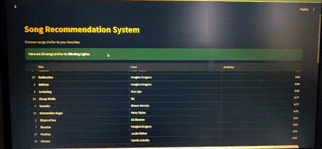
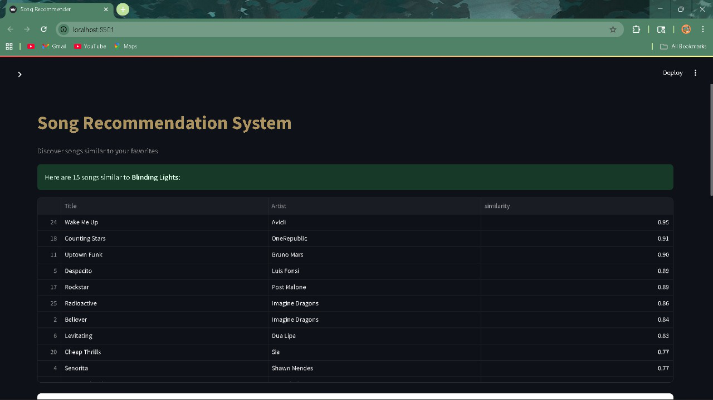

# 🎵 Song Recommendation System (ML4E Induction Task)

## 📌 Overview
This is a simple **content-based Song Recommendation System** built using Python, Pandas, Scikit-learn, and Streamlit.  
The system suggests similar songs based on audio features like **danceability, energy, and tempo**.  

It uses **cosine similarity** on normalized features to find the most similar songs.  
The project is hosted with a **Streamlit app** for interactive usage.

---

## 🚀 How It Works
1. **Preprocessing**  
   - Extracts numerical features (danceability, energy, tempo, etc.).  
   - Normalizes features using **Min-Max Scaling** (0–1 range).  

2. **Similarity Calculation**  
   - Uses **Cosine Similarity** to compare songs.  
   - Returns the top-N most similar songs.  

3. **Streamlit UI**  
   - Users enter a song name.  
   - System displays top similar songs in a table.

---

## 📂 Dataset
Currently, a small sample dataset is included for testing.  
For larger datasets:  
- Add features like loudness, valence, acousticness, etc.  
- Normalize them before similarity calculation.

---

## 🖼️ Screenshots
Here are some previews of the app:

### 🎵 Input Example


### 🎥 Demo GIF


---

## 🎥 Demo Video
You can watch a short demo here:  

[](https://github.com/yourusername/song-recommender-demo.mp4)

---

## 🛠️ Installation & Running
```bash
pip install streamlit pandas scikit-learn
streamlit run app.py

